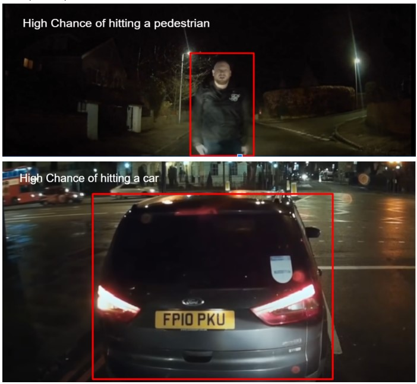

  

# PERCEPTION TASK 1

Computer Vision is a vast field that enables computers to derive meaningful information from digital images, videos and other visual inputs.Image detection and recognition is a crucial part of Machine Learning. Being able to process image data according to our own requirements is essential.

Lets say you are travelling in an open road on a vehicle with a camera over its front glass. You
will have to check if you are going to hit a pedestrian, another vehicle, wall, etc.

## OBJECT DETECTION

In this task, you are supposed to provide an video input where from the dashcam of a car, where other cars,pedestrians, objects are visible. The program should be able to first detect the object in front of the vehicle, and then optionally detect the type of obstacle: car, bike, pedestrian etc.

## Input

Video input can be provided to the program. The video input may be in the form of a video file saved in the local directory or in the form of a live camera input.

## Output

The program needs to Display the boundaries around the object detected like the image given below.

**For example:**

  

 **Note:** The output should be a video, not a picture. The examples given above are just for reference. Feel free to use any resource. You are free to use any video for the task.

## General Guidelines

 - You are free to use any programming language.
 - Try to optimize your approach as best as you can.

## Submission Guidelines

- Upload your work on your **github** in a private repository.
- You may upload the video on to drive and share the link/mention it on your github repo.
- Please **do not copy paste your code** :D (PS, we will get to know XD)

# Most Importantly, have fun and keep learning!
