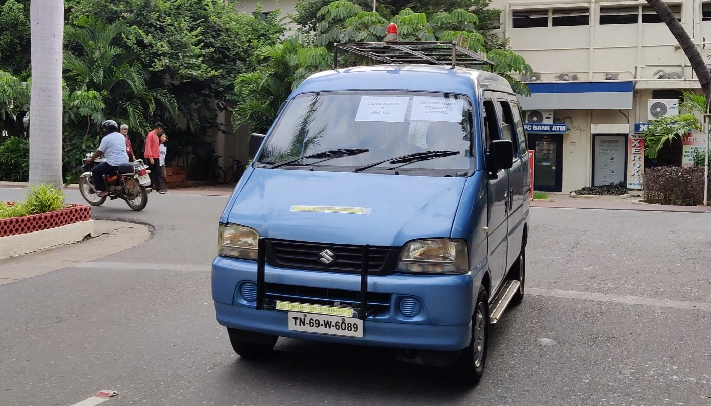

  

# PERCEPTION TASK 2

Image detection and recognition is a crucial part of Machine Learning. Being able to process image data according to our own requirements is essential.

## Number Plate Recognition

In this task, you are supposed to provide an image/video input where number plates of vehicles are visible. The program should be able to first detect the number plate on the vehicle, and then accurately recognize the text written on the number plate. This text can then be stored in a file (.txt or .csv format) and saved in a local directory on your computer.

## Input

Image/Video input can be provided to the program. The video input may be in the form of a video file saved in the local directory or in the form of a live camera input.

**For example:**

  

## Output

The program needs to do the following-

 1. Display the boundaries of the number plate that it has recognized.
 2. The same boundary should contain a textbox displaying the recognized text.
 3. The same text should be saved in a file in the local directory.

**For Example:**

  

 **Note:** In case of an image input, simply display the output and save the recognized text in a file. In case of a video (live video feed/video file), along with displaying the text as an overlay on the video, store the recognized text in a new line of the file at one second intervals for the duration of the video/live feed and hence save the file.

## General Guidelines

 - You are free to use any programming language.
 - You are free to use any **Machine Learning Framework** such as **YOLO, Detectron, MediaPipe** for the detecting the Region of Interest.
 - You can use any **OCR (Optical Character Recognition) Engine** for text recognition.
 - Use simple **File Handling** techniques for writing content to the .txt/.csv file.
 - Try to optimize your approach as best as you can.

## Submission Guidelines

- Upload your work on your **github** in a private repository.
- Create a readme file which has a rough explanation of the project.
- The output video should be rendered and uploaded to a drive and the link should be given in the readme file.
- Don't forget to make your repository and drive link public.
- The submission on [google colab](https://colab.research.google.com/) cannot be considered as the completion of the project. We expect you to try out everything on your local machine and upload all the documents to github.
- Please **do not copy paste your code** :D (PS, we will get to know XD)

# Most Importantly, have fun and keep learning!
