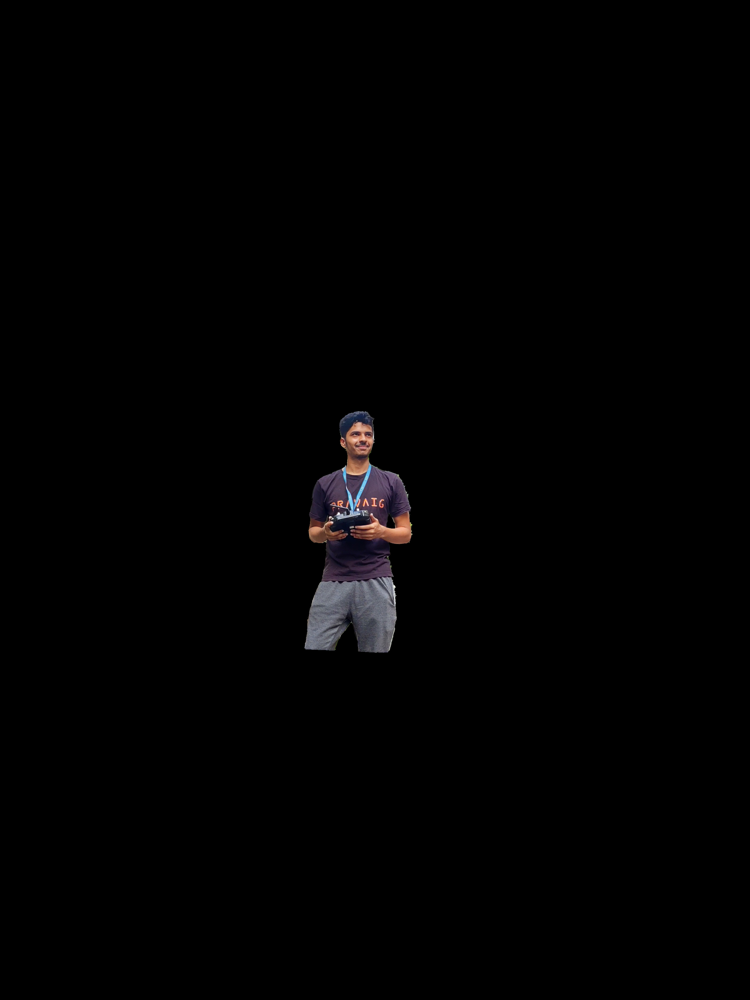

  

# PERCEPTION TASK 3

## Image Segmentation Task

In Task 2, you have successfully detected an object, localized it and Recognized the text. In this task, you will be going across image segmentation concepts to segment an object from the whole frame. The program should be able to detect humans from the frame and segment the person from the whole image and then mask those particular pixels.

## Input

Image/Video input can be provided to the program. The video input may be in the form of a video file saved in the local directory or in the form of a live camera input.

  

## Output

The program must display the segmented image of the person as given below.

  

## General Guidelines

 - You are free to use any programming language.
 - You are free to use any **Machine Learning Framework** such as **YOLO, Detectron, MediaPipe** for the project.
 - Try to optimize your approach as best as you can.

## Submission Guidelines

- Upload your work on your github repository.
- Create a readme file which has a rough explanation of the project.
- The output video should be rendered and uploaded to a drive and the link should be given in the readme file.
- Don't forget to make your repository and drive link public.
- The submission on [google colab](https://colab.research.google.com/) cannot be considered as the completion of the project. We expect you to try out everything on your local machine and upload all the documents to github.

# Most Importantly, keep learning and have fun!
